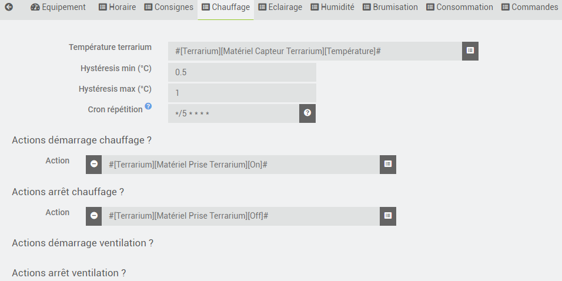
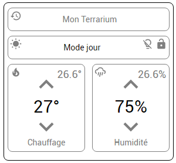
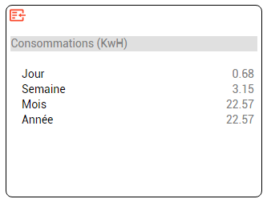

# Plugin terrarium pour Jeedom

    Ce plugin permet de domotiser un terrarium.
      Chauffage, ventilation, éclairage, brumisation et historisation des consommations ( jour, semaine, mois et année ).

    On pourrait faire la même chose en utilisant des scénarios, le plugin thermostat et le plugin agenda ou autres mais 
    ça me semblait un bon exercice pour faire connaissane avec la programmation d'un plugin.

## 1. Configuration du plugin

    Rien de particulier dans la configuration ce plugin, le cron est indispensable au bon
    déroulement du plugin, merci de ne pas le désactiver.

## 2. Onglet "Horaire"

    Cet onglet permet de choisir les dates de "lever et coucher du soleil" dans le terrarium, ce sont les
    déclencheurs qui permettent de passer en mode "Jour" et en mode "Nuit". La latitude et la longitude doivent être introduits
    si on désire utiliser les heures de lever et de coucher du soleil. Si la case lever ou coucher du soleil est cochée, 
    le cron est calculé automatiquement et remplacé dans la configuration. Ce calcul s'effectue à minuit.

## 3. Onglet "Consignes"

    Cet onglet permet de choisir les températures mini et maxi de la consigne, ainsi que les actions qui seront effectuées
    lors du passage en mode jour ou en mode nuit. 

    La première action à effectuer est évidemment le changement de la consigne de température, on utilisera pour cela la commande 
    Thermostat du plugin comme sur l'image qui suit.

     NB Le plugin permet de bloquer les actions de consigne. Si le Gecko reçoit des amis pour la nuit, on peut bloquer la consigne
     sans que le plugin n'interfère.

## 4. Onglet "Chauffage"

    Cet onglet permet de choisir les actions qui seront effectuées lors du démarrage ou de l'arrêt du chauffage. 
    Pour effectuer le contrôle du chauffage, nous avons besoin de la température intérieure du terrarium, des hysteresis 
    min/max pour le déclenchement et l'arrêt du chauffage et d'un cron de répétition pour répèter les actions 
    périodiquement en cas de problème de transmission par exemple.

    En cas de surchauffe ( température >= consigne + hysteresis max * 2 ), on peut enclencher des actions qui permettront 
    d'enclencher la ventilation du terrarium. Cette ventilation prendra fin quand la température reviendra dans une fourchette 
    normale.

## 5. Onglet "Eclairage"

    Cet onglet permet de choisir les actions d'éclairage qui seront effectuées lors du passage en mode jour ou en mode nuit. 
    Ces actions pourront être répètées périodiquement grâce à un cron de répétition. 
    
      NB Le plugin permet de bloquer les actions d'éclairage

## 6. Onglet "Humidité"

    Cet onglet permet de choisir les actions qui seront effectuées lors du démarrage ou de l'arrêt de la gestion de l'humidité. 
    Pour effectuer le contrôle de l'humidité, nous avons besoin de l'humidité intérieure du terrarium, des hysteresis min/max 
    et d'un cron de répétition pour répèter les actions périodiquement en cas de problème de transmission par exemple.

## 7. Onglet "Brumisation"

    Cet onglet permet de choisir les actions qui seront effectuées lors du démarrage ou de l'arrêt de la gestion de la brumisation.
    Pour effectuer le contrôle de la brumisation, nous avons besoin d'une programmation horaire, des actions à effectuer et d'un
    temps de brumisation. 

## 8. Onglet "Consommation"

    Si le chauffage du terrarium est commandé par un matériel qui remonte la consommation en KwH, 
    on peut utiliser cette information pour historiser les consommations ( jour, semaine, mois et année ) du terrarium.

        NB J'ai pris soin de la base de données de Jeedom en gérant l'historisation de façon à n'avoir qu'une seule donnée 
        historisée par jour, semaine, mois et année. Ceci explique les commandes consoJour, consoSemaine, consoMois, consoAnnee 
        qui mémorisent les consommations instantanées et les commandes histoJour, histoSemaine, histoMois et histoAnnee qui 
        permettent l'historisation "optimisée".

## 9. Et le widget

    Le plugin a son propre widget, en voici la première version

    Dans la première tuile, on retrouve le nom de l'équipement une icone qui permet d'afficher les consommations 
    instantanées de chauffe.

    On peut voir un soleil en haut à droite pour le mode "Jour", une lune pour le mode "Nuit".
    Une ampoule barrée ou non qui empêche ou pas les changements d'éclairage par le plugin.
    Un cadenas qui empêche ou pas les changements de consigne par le plugin.

    Un pavé sous-titré "Chauffage" qui donne la consigne d'humidité, l'humidité actuelle,
    une icone "flamme" pour indiquer que la chauffe est active et une icone "ventilateur" pour indiquer
    que la ventilation est active.

    Un pavé sous-titré "Humidité" qui donne la consigne de température, la température actuelle,
    une icone "nuage" pour indiquer que l'humidification est active.
    
    Les consignes sont modifiables au moyen des flêches.

